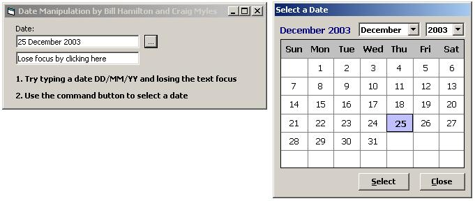



## Better than 'Better than MS Calendar Control'

### Description

"Better than "Better than MS Calendar Control"

Quick substitute for the MS Calendar control accessed through a function called GetOneDate.

Also validates Dates typed manually

Function shows form modal and hides it after the selection

By: Bill Hamilton & Craig Myles
 
### More Info
 

             |
---                |---
**Submitted On**   |2003-12-09 08:41:04
**By**             |[Craig Myles](https://github.com/Planet-Source-Code/PSCIndex/blob/master/ByAuthor/craig-myles.md)
**Level**          |Intermediate
**User Rating**    |5.0 (20 globes from 4 users)
**Compatibility**  |VB 6\.0
**Category**       |[Math/ Dates](https://github.com/Planet-Source-Code/PSCIndex/blob/master/ByCategory/math-dates__1-37.md)
**World**          |[Visual Basic](https://github.com/Planet-Source-Code/PSCIndex/blob/master/ByWorld/visual-basic.md)
**Archive File**   |[Better\_tha1682071292003\.zip](https://github.com/Planet-Source-Code/craig-myles-better-than-better-than-ms-calendar-control__1-50388/archive/master.zip)

